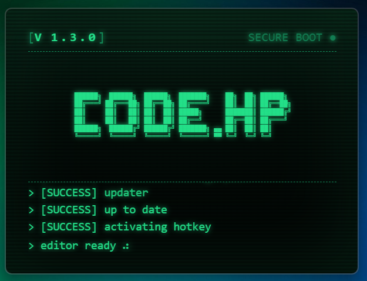

# Code.HP

> A retro-futuristic code snippet manager built with Electron and Monaco Editor.

---

## ✨ Features

- 👽 Retro-futuristic alien-inspired interface
- 📝 Monaco Editor with VS Code syntax highlighting
- 🌐 Support for 25+ programming languages
- 🔍 Real-time snippet search
- 📁 File-based snippet storage
- ⚡ Fast startup and lightweight workflow
- 🔄 Automatic updates

---

## 📸 Gallery

---

### Splash Screen

<p align="center">
  
</p>

---
### Main Window

<p align="center">
  
</p>

---

### Creating a Snippet

<p align="center">
  
</p>

---

### Monaco Editor

<p align="center">
  
</p>


## 🚀 Installation

Download the latest release from the Releases page and run:

```
Code.HP Setup.exe
```

A desktop shortcut will be created automatically.

---

## 📁 Project Structure

```
Code.HP/
├── app/
│   ├── assets/
│   │   ├── fonts/
│   │   │   └── vt323.css
│   │   ├── icon.ico
│   │   └── screenshots/
│   ├── main/
│   │   ├── deps/
│   │   │   ├── electron.deps.js
│   │   │   └── render-deps.js
│   │   ├── electron/
│   │   │   ├── electron-main.js
│   │   │   └── Kernel.js
│   │   ├── services/
│   │   │   ├── IpcHandler.js
│   │   │   ├── Launch.js
│   │   │   ├── Logger.js
│   │   │   ├── Shortcut.js
│   │   │   ├── Storage.js
│   │   │   ├── StoragePath.js
│   │   │   └── Updater.js
│   │   └── windows/
│   │       ├── MainWindow.js
│   │       └── SplashWindow.js
│   └── renderer/
│       ├── mainWindow/
│       │   ├── mainWindow.html
│       │   ├── css/
│       │   │   ├── base.css
│       │   │   ├── components.css
│       │   │   ├── editor.css
│       │   │   ├── layout.css
│       │   │   ├── main.css
│       │   │   └── theme.css
│       │   └── js/
│       │       ├── language-definitions.js
│       │       ├── main.js
│       │       └── monaco-editor.js
│       └── splashWindow/
│           ├── splashWindow.html
│           ├── css/
│           │   └── splash.css
│           └── js/
│               └── splash.js
├── scripts/
│   └── Code.HP.vbs
└── snippets/
    ├── Bootstrap-links-4.html
    ├── card-container-9.css
    ├── drag-and-drop-6.js
    ├── electron-main-3.js
    ├── git-commands-cheat-sheet-13.txt
    ├── hotkey-setup-electron-2.js
    ├── liquid-glass-effect-10.css
    ├── OOP-detyra-11.cs
    ├── OOP-detyra-sutend-12.cs
    └── supabase_client-14.py

---

## 🛠️ Development

```bash
npm install
npm run dev
```

To create a production build:

```bash
npm run build
```

---

See the project's roadmap and license here:

**[TODO.md](TODO.md)**

---

## 📄 License

**[MIT License](LICENSE)**
 
---

**Version:** 1.3.0